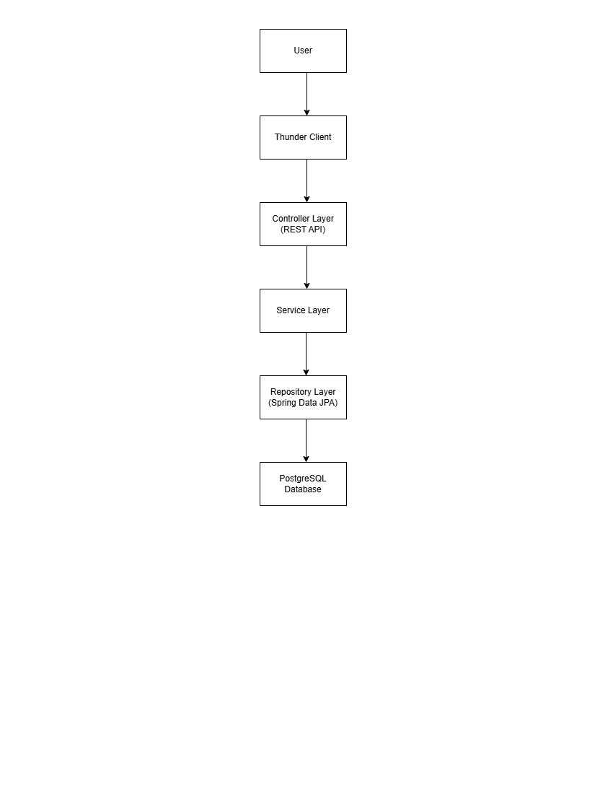
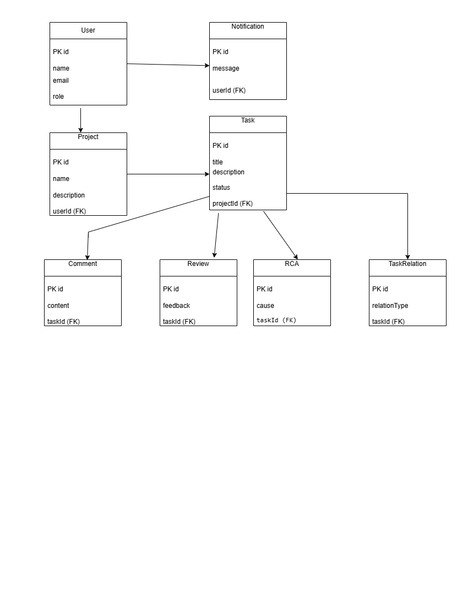

# TeamFlow Application

## Project Overview

TeamFlow Application is a Spring Boot REST API developed for managing team projects and tasks. It enables users to create projects, manage tasks, track task dependencies, perform root cause analysis (RCA), add comments, manage reviews, and send notifications.

The application follows a layered architecture using Spring Boot, Spring Data JPA, and PostgreSQL.

---

## Technologies Used

- Java 17
- Spring Boot
- Spring Data JPA (Hibernate)
- PostgreSQL
- Maven
- Thunder Client (API Testing)
- Git & GitHub

---

## Features Implemented

- User Management
- Project Management
- Task Management
- Task Relationship Management
- Comments Management
- Notifications
- Review Management
- Root Cause Analysis (RCA)
- RESTful CRUD APIs
- PostgreSQL Database Integration

---

## API Endpoints

### User APIs
- GET /users
- POST /users
- PUT /users/{id}
- DELETE /users/{id}

### Project APIs
- GET /projects
- POST /projects
- PUT /projects/{id}
- DELETE /projects/{id}

### Task APIs
- GET /tasks
- POST /tasks
- PUT /tasks/{id}
- DELETE /tasks/{id}

### Comment APIs
- GET /comments
- POST /comments

### Notification APIs
- GET /notifications
- POST /notifications

### Review APIs
- GET /reviews
- POST /reviews

### RCA APIs
- GET /rcas
- POST /rcas

### Task Relation APIs
- GET /taskrelations
- POST /taskrelations

---

# Setup Instructions

## 1. Clone the Repository

```bash
git clone https://github.com/mareddy-1210/TeamFlow-application.git
```

## 2. Open the Project

Open the **Teamflow** project in Visual Studio Code or IntelliJ IDEA.

---

## 3. Configure PostgreSQL

Create a PostgreSQL database named:

```
Teamflow
```

Update the database configuration in:

```
src/main/resources/application.properties
```

```properties
spring.datasource.url=jdbc:postgresql://localhost:5432/Teamflow
spring.datasource.username=postgres
spring.datasource.password=<your_postgresql_password>

spring.jpa.hibernate.ddl-auto=update
spring.jpa.show-sql=true
```

Replace `<your_postgresql_password>` with your PostgreSQL password.

---

## 4. Build the Project

```bash
mvn clean install
```

---

## 5. Run the Application

```bash
mvn spring-boot:run
```

The application will run at:

```
http://localhost:8080
```

---

# Environment Variables Required

Configure the following properties in `application.properties`:

```properties
spring.datasource.url
spring.datasource.username
spring.datasource.password
```

---

# Assumptions Made During Implementation

- Each project belongs to one user.
- Each project can contain multiple tasks.
- Each task can have multiple comments.
- Each task can have reviews.
- Notifications are associated with users.
- RCA is maintained for task analysis.
- Task relationships represent dependencies between tasks.

---

# Features Implemented

- CRUD Operations for Users
- CRUD Operations for Projects
- CRUD Operations for Tasks
- CRUD Operations for Comments
- CRUD Operations for Notifications
- CRUD Operations for Reviews
- CRUD Operations for RCA
- CRUD Operations for Task Relations
- PostgreSQL Integration
- RESTful API Design

---

# Known Limitations

- Authentication and Authorization are not implemented.
- Frontend UI is not included.
- Pagination and filtering are not implemented.
- Advanced validation can be improved.
- Logging and exception handling can be enhanced.

---

# Database Schema

The database consists of the following entities:

- User
- Project
- Task
- Comment
- Notification
- Review
- RCA
- TaskRelation

Refer to the **ER Diagram** included in the repository.

---

# Architecture

The application follows a layered architecture.

```
              User
                │
                ▼
     Spring Boot REST Controllers
                │
                ▼
          Service Layer
                │
                ▼
      Repository Layer (JPA)
                │
                ▼
       PostgreSQL Database
```

Refer to the **Architecture Diagram** included in the repository.

---

# API Testing

All REST APIs were tested using **Thunder Client**.

---
## Architecture Diagram



## ER Diagram



# Author

**Pranavi Reddy Mareddy**

GitHub:
https://github.com/mareddy-1210/TeamFlow-application
